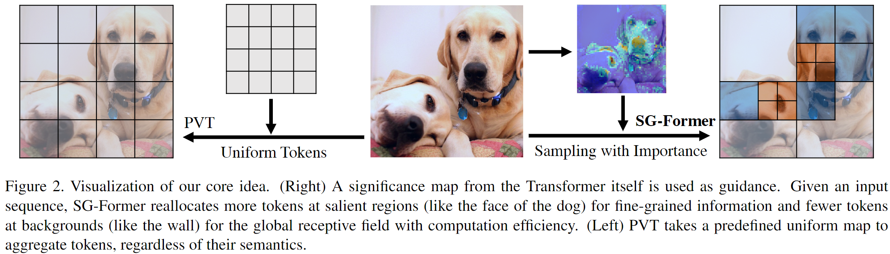

# SG-Former
This repository is the official implementation of our

SG-Former: Self-guided Transformer with Evolving Token Reallocation (ICCV2023)

[[arxiv](https://arxiv.org/abs/2308.12216)] [[github](https://github.com/OliverRensu/SG-Former)]

[Sucheng Ren](https://oliverrensu.github.io/), [Xingyi Yang](https://adamdad.github.io/), [Songhua Liu](https://scholar.google.com/citations?user=AnYh2rAAAAAJ&hl=en), [Xinchao Wang](https://sites.google.com/site/sitexinchaowang/)

## Introduction
Vision Transformer has demonstrated impressive success across various vision tasks. However, its heavy computation cost, which grows quadratically with respect to the token sequence length, largely limits its power in handling large feature maps. To alleviate the computation cost, previous works rely on either fine-grained self-attentions restricted to local small regions, or global self-attentions but to shorten the sequence length resulting in coarse granularity. In this paper, we propose a novel model, termed as Self-guided Transformer~(SG-Former), towards effective global self-attention with adaptive fine granularity. At the heart of our approach is to utilize a significance map, which is estimated through hybrid-scale self-attention and evolves itself during training, to reallocate tokens based on the significance of each region. Intuitively, we assign more tokens to the salient regions for achieving fine-grained attention, while allocating fewer tokens to the minor regions in exchange for efficiency and global receptive fields. 



## Data prepare
ImageNet with the following folder structure.
```
│imagenet/
├──train/
│  ├── n01440764
│  │   ├── n01440764_10026.JPEG
│  │   ├── n01440764_10027.JPEG
│  │   ├── ......
│  ├── ......
├──val/
│  ├── n01440764
│  │   ├── ILSVRC2012_val_00000293.JPEG
│  │   ├── ILSVRC2012_val_00002138.JPEG
│  │   ├── ......
│  ├── ......
```

## Requirements
```bash
bash install_req.sh
```

## Train

Train SG-Former variants: Small, Medium, Base
```shell
python -m torch.distributed.launch --nproc_per_node=8 main.py \
 --data /path/to/imagenet/ \
 --model sgformer_s -b 128 --lr 1e-3 \
 --weight-decay .05  --amp --img-size 224  --warmup-epochs 20 \
 --model-ema-decay 0.99992 --drop-path 0.1
```
```shell
python -m torch.distributed.launch --nproc_per_node=8 main.py \
 --data /path/to/imagenet/ \
 --model sgformer_m -b 128 --lr 1e-3 \
 --weight-decay .05  --amp --img-size 224  --warmup-epochs 20 \
 --model-ema-decay 0.99992 --drop-path 0.2
```
```shell
  python -m torch.distributed.launch --nproc_per_node=8 main.py \
  --data /path/to/imagenet/  \
  --model sgformer_b  -b 128 --lr 1e-3  \
  --weight-decay .05  --amp --img-size 224  --warmup-epochs 20  \
  --model-ema-decay 0.99992  --drop-path 0.4
```
If the GPU memory is not enough, please use 16 GPUs across different machine
```shell
  python -m torch.distributed.launch --nproc_per_node=8 \
  --nnodes 2 --node_rank 0 --master_addr ip_addr  --master_port port \
  main.py  --data /path/to/imagenet/  \
  --model sgformer_b  -b 64 --lr 1e-3  \
  --weight-decay .05  --amp --img-size 224  --warmup-epochs 20  \
  --model-ema-decay 0.99992  --drop-path 0.4
```

## Checkpoint
The pretrained checkpoints are available at [Google Drive](https://drive.google.com/drive/folders/1ZJDEwxDffqqqzBC2SzhOkpWpGRweDsE4?usp=sharing)


## Citation
If you have any question, feel free to contact [Sucheng Ren](oliverrensu@gmail.com) :)
```
@article{ren2023sgformer,
    author    = {SG-Former: Self-guided Transformer with Evolving Token Reallocation},
    title     = {Sucheng Ren, Xingyi Yang, Songhua Liu, Xinchao Wang},
    journal   = {International Conference on Computer Vision (ICCV)},
    year      = {2023},
}
```
